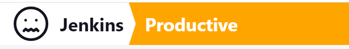
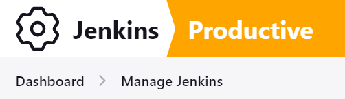
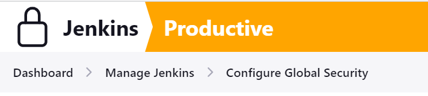

Customizable Header Plugin
==========

- [About](#about-the-plugin)
- [Logo](#the-logo)
- [Application Links](#application-links-and-favorites)
- [System Messages](#system-messages)
- [Classic Search](#classic-search)

## About the plugin
This plugin allows to customize the Jenkins header.

You can change the logo, the text next to the logo, the background, add application links (links to external pages, internal pages or items marked as favorites) and add system messages.

The plugin offers 2 layouts for the header.
- Default Jenkins header: The complete header gets the selected background
- Sectioned header: The header is visually divided into 2 parts.
  * On the left there is a logo followed by a text. As the original header this is a link to Jenkins root. This part uses the jenkins theme, thus colors change together with the selected theme.
  * After a separator (just some simple clip-path with a polygon) the title is shown followed by the crumb bar and the actions.

## Configuration
The plugin is configured via `Manage Jenkins -> Appearance`.
After installation of the plugin, only system messages and application links are enabled.

Click `Customize Header` to enable changing logo, text, title and colors.


## The logo
The logo can be turned off, you can use the default Jenkins logo, use a png or jpeg image, an SVG icon.
Ideally you use an SVG as they can be made working nicely with the dark theme.
You can also choose a symbol from any plugin that provides symbols (see [Design Library](https://weekly.ci.jenkins.io/design-library/symbols/)) 
how to specify a symbol (e.g. the screenshots below use `symbol-jenkins`)<br/>
Optionally the logo can be made context aware. In this mode the logo corresponds to the context, e.g. on a job it displays the job status or the job weather. On Folders the folder icon or the folder weather, on computers the computer state. And on many manage pages the corresponding symbol. In case no mapping is found then the globally defined logo is used.

## The logo text
By default, the text `Jenkins` is displayed. You can choose any text you like or make it empty to display nothing.
Logo and logo text form a hyperlink that gets you back to the Jenkins root page (similar to the original header).

## The title
Optionally an additional title can be shown after a separator. The title is formatted using the global markup
formatter (see <code>Manage Jenkins > Security > Markup Formatter</code>). Depending on the configured formatter it may
contain html, e.g. to include a link to some other site. Css already takes care to make the link properly styled.

## Application links and favorites
The plugin allows to configure additional links that are accessible via a button to the left of the logo. Users can define their personal links in their settings.

When the [Favorite Plugin](https://plugins.jenkins.io/favorite) is installed, your personal favorites will
be added as well to this menu.

<br/>

## System Messages
One or more system messages can be shown below the header. This allows to notify users about important
things related to the instance, e.g. a planned update of Jenkins, a downtime due to hardware replacement or an ongoing
incident. The message is formatted using the global markup formatter (see <code>Manage Jenkins > Security > Markup
Formatter</code>). Depending on the configured formatter it may contain html, e.g. to apply some simple styling or
include a link with more details.<br/>
System messages can have an expiration time to automatically remove them. They can be dismissed on a per-user basis (can be disabled). 

<br/>

### Create/Delete System Messages via REST api
You can create system messages by doing a post request to `<jenkins_url>/customizable-header/addSystemMessage`.
To be able to later delete a system message, pass an id parameter in the call. In case you omit the id, an id will be generated and returned in the response body.

Parameters:

| Parameter    | required | description                                                  |
|--------------|----------|--------------------------------------------------------------|
| message      | true     | The message, can contain html                                |
| level        | true     | Message level, one of `info`, `success`, `warning`, `danger` |
| expireDate   | false    | Expiration date for the message, format: `yyyy-M-d H:m`      |
| uid          | false    | An optional unique id                                        |
| dismissible  | false    | Message can be dismissed by users, defaults to `true`        |

To delete a system message do a post request to `<jenkins_url>/customizable-header/deleteSystemMessage?id=<id>`

## Classic Search
The Command Palette that was introduced with 2.489 has the drawback that it doesn't allow to forward to the old search page that lists all matching things.
You can now bring back a search box in the header by going to your users `Appearance` setting and check `Classic Search`. 

The search box will list the first 15 matches for the given query. These entries are direct links to the matching things. Pressing `Enter` will get you to the search page that will list everything that matched based on the active search engine (e.g. nested-view and lucene-search plugins offer alternative searches).

<br/>

## The weather symbols
To demonstrate the custom weather symbols download the svgs from `docs/svgs` to `userContent/svgs` in your
`JENKINS_HOME`, put the following into a properties file in your `JENKINS_HOME` and configure the additional mappings
to it.
```
icon-health-00to19=file-userContent/svgs/mood-sick.svg
icon-health-20to39=file-userContent/svgs/mood-sad.svg
icon-health-40to59=file-userContent/svgs/mood-empty.svg
icon-health-60to79=file-userContent/svgs/mood-smile.svg
icon-health-80plus=file-userContent/svgs/mood-happy.svg
```


### Screenshots
<br/>
<br/>
<br/>


#### Dark Theme


#### Gradient


### Context Aware Header Screenshots
#### Job Status


#### Weather


#### Custom Weather
<br/>


#### Manage something
<br/>


